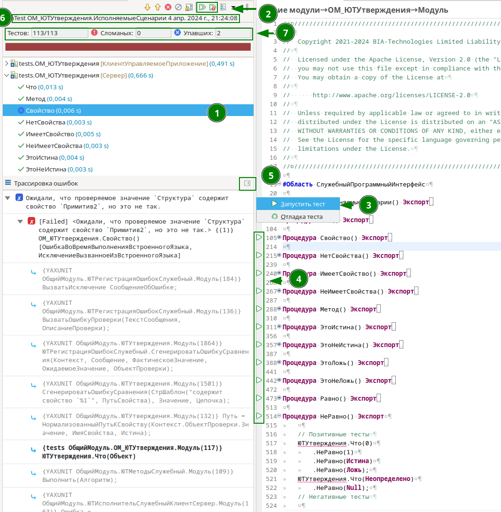

# Плагин для работы с модульными (unit) тестами в среде разработки EDT

Плагин является адаптацией [JUnit плагина](https://github.com/eclipse-jdt/eclipse.jdt.ui/tree/master/org.eclipse.jdt.junit) под работу в EDT

* Позволяет запускать и отлаживать тесты написанные на языке 1С:Предприятия.
* Просматривать результаты выполнения
* Поддерживает работу с тестовым движком [YAXUnit](https://github.com/bia-technologies/yaxunit), который используется для разработки и исполнения тестов.

Для начала использования вам необходимо:

1. [Установить плагин](docs/Установка.md)
2. Установить тестовый движок [YAXUnit](https://github.com/bia-technologies/yaxunit) в workspace

Все готово к работе.

## Запуск тестов

1. Для начала предлагаю ознакомиться с [документацией](https://github.com/bia-technologies/yaxunit/blob/master/README.md) тестового движка
2. После установки у вас должны быть:
   1. Тестовое расширение с движком, в котором мы будем создавать тесты.

      *Под тесты можно создать отдельное расширение, но для удобства разработки мы будем использовать то же расширение.*
   2. Новый тип конфигурации запуска
   
3. Используя [документацию](https://github.com/bia-technologies/yaxunit/blob/master/README.md) создадим тест.
4. Для его запуска создадим новую конфигурацию запуска
   
   Настройки:
   * `Конфигурация запуска 1С:Предприятия` - конфигурация, используемая для запуска 1С:Предприятие
     * `Отбор` - Позволяет фильтровать запускаемые тесты
       * `Тестовое расширение` - расширение, которому принадлежит модуль тестов
       * `Тестовый модуль` - модуль, тесты которого нужно запустить
5. Запускаем созданную конфигурацию, после выполнения получаем отчет.

## Интерфейс редактора

1. Отчет о тестовом прогоне
2. Команды перезапуска тестов
3. Команды запуска всех тестов модуля
4. Команды запуска конкретных тестовых методов
5. Информация об ошибке и сравнении ожидаемого и актуального значения
6. Контекстное меню отчета
7. Информация о конфигурации и времени запуска
8. Общая статистика по выполненным тестам
