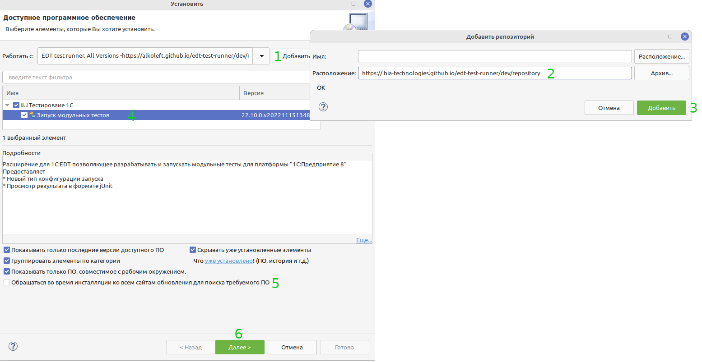
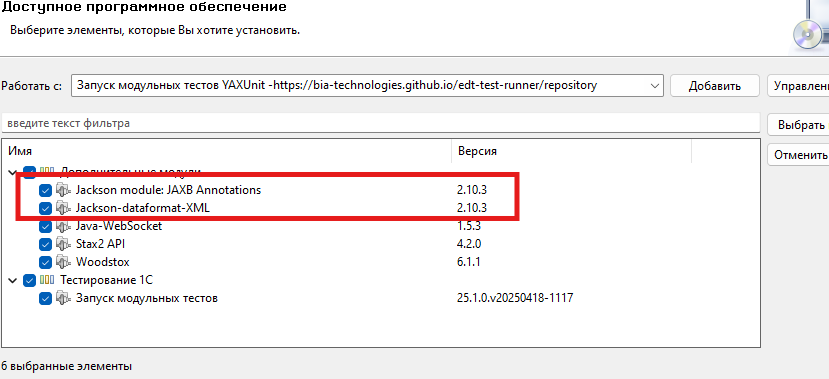
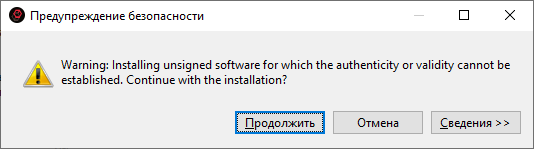
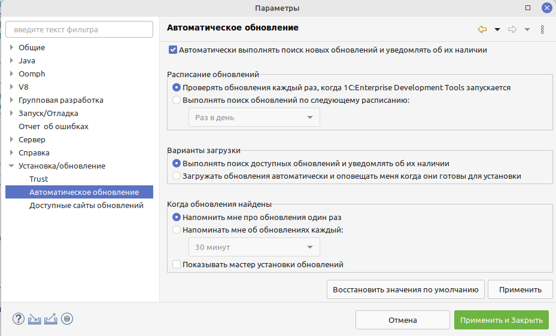
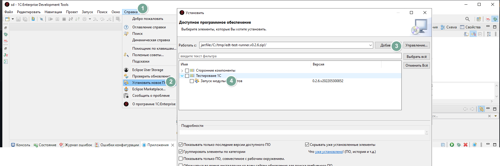

# Установка плагина в EDT (Eclipse)

Текущая версия плагина работает только с EDT версии 2023.2.

## Установка из p2 репозитория

1. Открываем EDT. Переходим к `Установить новое ПО` (в меню `Справка`)
2. Добавляем новый репозиторий, если еще не добавляли
   * Если версия EDT больше 2023.2 
       * `https://bia-technologies.github.io/edt-test-runner/repository` - Основной репозиторий
       * `https://bia-technologies.github.io/edt-test-runner/dev/repository` - Репозиторий develop
   * Если версия EDT старше 2023.2
       * `https://bia-technologies.github.io/edt-test-runner/repository/updates/23.x`

    

    **ВНИМАНИЕ!**
    _На текущий момент, при установке обязательно доустанавливайте требуемые зависимости, в частности - модуль Jackson требуемых версий (ниже 2.15) т.к в противном случае ЕДТ доустановит самый свежий модуль, который  конфликтует с текущей версией ЕДТ (как 2024.х.х, так и 2025.х.х), что может нарушить работу ЕДТ_
    

4. Для ускорения установки можно убрать галочку "Обращаться во время инсталляции ко всем сайтам ..."
5. Нажимаем далее
6. Принимаем лицензию
7. Соглашаемся с предупреждением безопасности (может выглядеть иначе)
    
8. И перезагружаем IDE
9. В дальнейшем вы сможете автоматически получать обновления плагина
10. Также можно настроить автоматическую проверку обновлений (`Справка` -> `Проверить обновления`)

    

## Установка оффлайн

1. [Скачиваем](https://github.com/bia-technologies/edt-test-runner/releases) архив последней версии
2. Переходим в EDT, устанавливаем новое ПО

    
3. Для ускорения установки можно убрать галочку "Обращаться во время инсталляции ко всем сайтам ..."
4. Нажимаем далее
5. Принимаем лицензию
6. Соглашаемся с предупреждением безопасности (может выглядеть иначе)

    
7. И перезагружаем IDE
