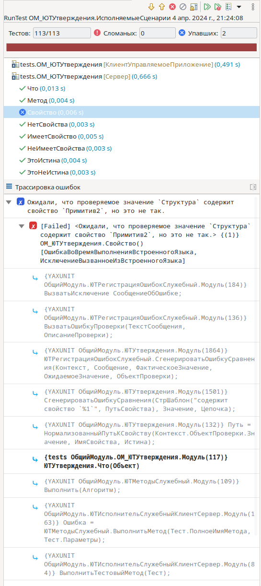

# Функции плагина

## Запуск тестов

В первую очередь, плагин предоставляет новую конфигурацию запуска, позволяя указать настройки запуска тестов.

После создания конфигурация запуска тестов, появляется возможность запустить выполнение тестов, используя стандартное меню EDT _(также как и 1С:Предприятие)_.

Кроме конфигурации запуска тестов, плагин добавляет команды запуска тестова для конкретных методов, а также тестовых модулей. 
Справа от имени каждого тестового метода появляется кнопка запуска, запускающая этот тест или все тесты модуля _(если выполнить запуск тестова для метода `ИсполняемыеСценарии`)_. 

Для удобства, эти команды продублированы в контекстное меню на панеле "Схема модуля".

## Отчет о тестировании

По окончании тестирования плагин выводит отчет в котором детально отображается список пройденных тестов, статус их прохождения и информация о возникших ошибках.

Отчет позволяет:

* Получить информацию о результате тестирования;
* Перезапустить тесты _(упавшие, все или выбранные)_;
* Посмотреть историю тестовых прогонов;
* Перейти к тесту и тестируемому методу;
* Просмотреть стек ошибки и перейти к месту их возникновения;
* Увидеть различие ожидаемого и фактического значения.

## Навигация между тестом и тестируемым методом

При написании тестов часто требуется быстро переходить от теста к тестируемому методу и обратно. Для этого добавлена команда `Перейти к тесту/тестируемому методу`, расположенная в контекстном меню редактора, схеме модуля и в отчете.

Команда позволяет перейти к связанному тесту, если вы находитесь модуле конфигурации и к тестируемому методу, если в модуле с тестами.

Для того, чтобы переходы работали модули должны придерживаться [схемы наименования](Схема%20наименования.md).

