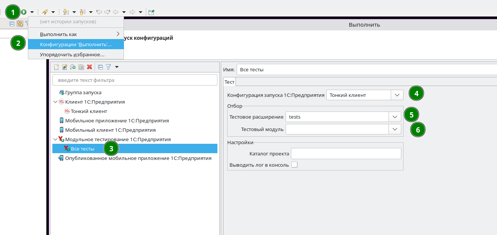

# Модульные тесты

Для запуска модульных тестов необходимо создать конфигурацию запуска

Настройки:

* `Базовая конфигурация запуска` - конфигурация запуска 1С:Предприятие
* `Тестовое расширение` - расширение, которому принадлежит модуль тестов
* `Тестовый модуль` - модуль, тесты которого нужно запустить

Примеры:

1. Для запуска всех тестов нужно указать только `Базовая конфигурация запуска`.
2. Для запуска тестов из конкретного модуля - указать все настройки поочереди.
