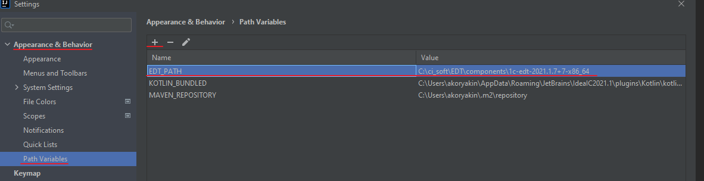
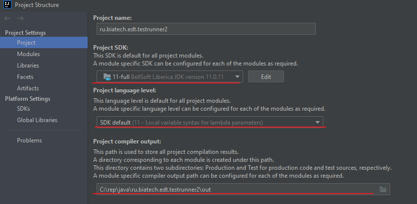

# Разработка в IDEA

## Требования

* Для разработки требуется EDT установленная из **оффлайн** дистрибутива.
* В IDEA необходимо установить плагин `OSGi`

## Настройка проекта

1. Настроить [переменную пути](https://www.jetbrains.com/help/idea/absolute-path-variables.html#ignored-path-variables) указывающую на установленную версию EDT
   1. Открываем настройки IDEA: File → Settings.
   2. Переходим к настройкам переменных пути: Appearance & Behavior → Path Variables.
   3. Создаем переменную `EDT_PATH`, в которой прописываем путь до установленной версии EDT

      
2. Перезапустить IDEA
3. Проверить настройки проекта File → Project Structure → Project Settings → Project

   

## Gradle

Ведутся эксперименты использовать gradle для управления проектом

Сейчас реализовано:

* Сборка плагина через запуск команды maven (для этого он должен быть установлен и указан в переменной PATH)
* Заполнение лицензий
* Публикация плагина в каталог

Для настройки необходимо в файле параметров `gradle.properties` указать:

```properties
edtLocation=<Путь к установленной EDT>
publishTo=<Путь к каталогу, в который публикуется плагин>
```

Что нужно реализовать:

* Запуск и отладка из idea gradle проекта
* Публикация в p2 репозиторий
