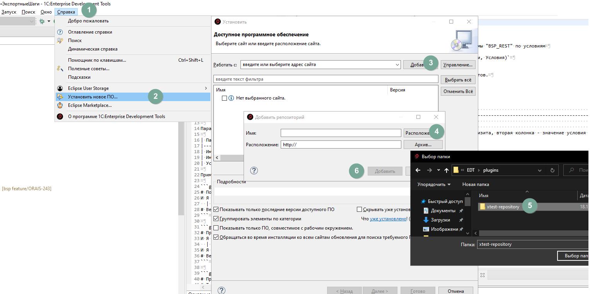
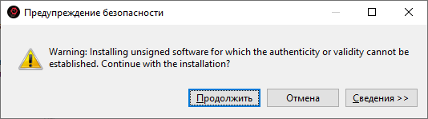

# Установка плагина в EDT (Eclipse)

1. [Скачиваем](https://github.com/bia-technologies/edt-test-runner/releases) архив последней версии
2. Переходим в EDT, устанавливаем новое ПО
    
3. Для ускорения установки можно убрать галочку "Обращаться во время инсталляции ко всем сайтам ..."
4. Нажимаем далее
5. Принимаем лицензию
6. Соглашаемся с предупреждением безопасности (может выглядеть иначе)
    
7. И перезагружаем IDE
