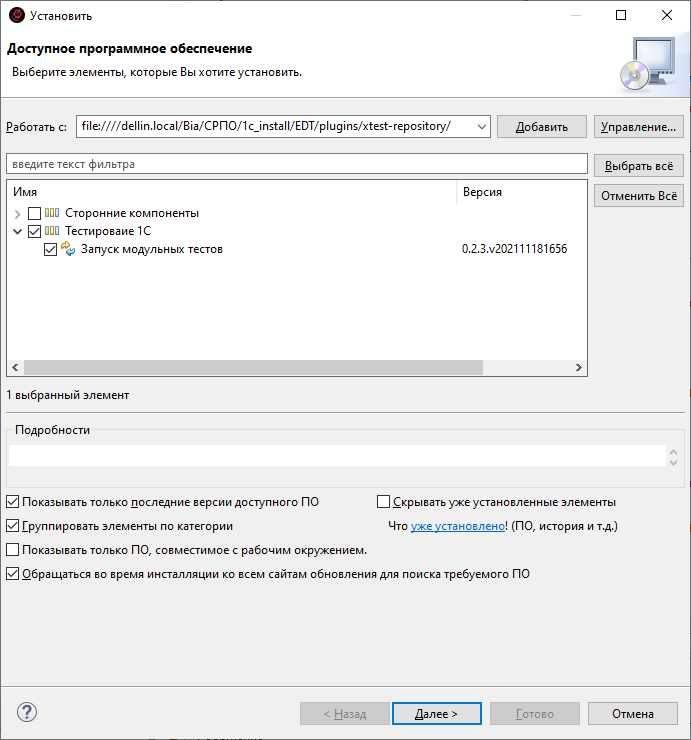

# Установка плагина в EDT(Eclipse)

1. Выбираем репозиторий: `\\dellin.local\Bia\СРПО\1с_install\EDT\plugins\xtest-repository`

    
2. Отмечаем нужный плагин

    
3. Для ускорения установки можно убрать галочку "Обращаться во время инсталляции ко всем сайтам ..." (внизу)
4. Нажимаем далее
5. Принимаем лицензию
6. Соглашаемся с предупреждением безопасности

    
7. И перезагружаем IDE
