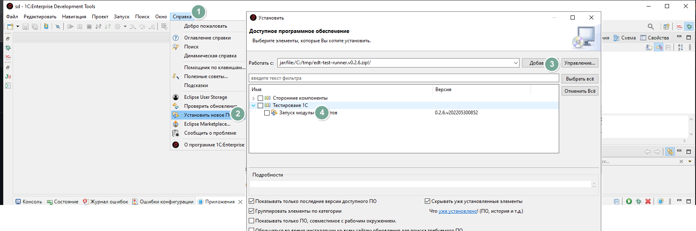

# Установка плагина в EDT (Eclipse)

## Установка из p2 репозитория

1. Открываем EDT. Переходим к `Установить новое ПО` (в меню `Справка`)
2. Добавляем новый репозиторий, если еще не добавляли
   * `https://bia-technologies.github.io/edt-test-runner/repository` - Основной репозиторий
   * `https://bia-technologies.github.io/edt-test-runner/dev/repository` - Репозиторий develop
    
3. Для ускорения установки можно убрать галочку "Обращаться во время инсталляции ко всем сайтам ..."
4. Нажимаем далее
5. Принимаем лицензию
6. Соглашаемся с предупреждением безопасности (может выглядеть иначе)
    
7. И перезагружаем IDE
8. В дальнейшем вы сможете автоматически получать обновления плагина
9. Также можно настроить автоматическую проверку обновлений (`Справка` -> `Проверить обновления`)
    

## Установка оффлайн

1. [Скачиваем](https://github.com/bia-technologies/edt-test-runner/releases) архив последней версии
2. Переходим в EDT, устанавливаем новое ПО
    
3. Для ускорения установки можно убрать галочку "Обращаться во время инсталляции ко всем сайтам ..."
4. Нажимаем далее
5. Принимаем лицензию
6. Соглашаемся с предупреждением безопасности (может выглядеть иначе)
    
7. И перезагружаем IDE
